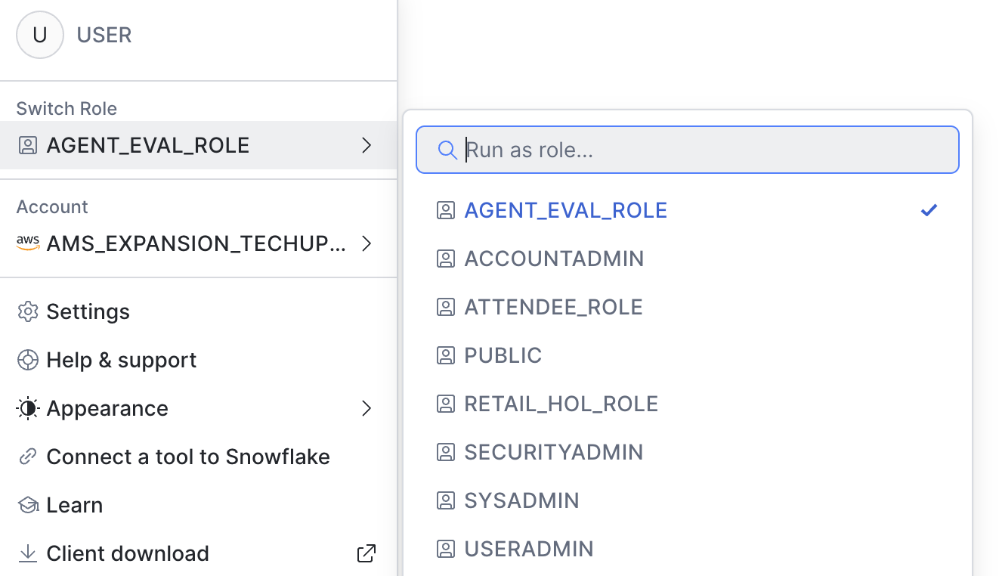
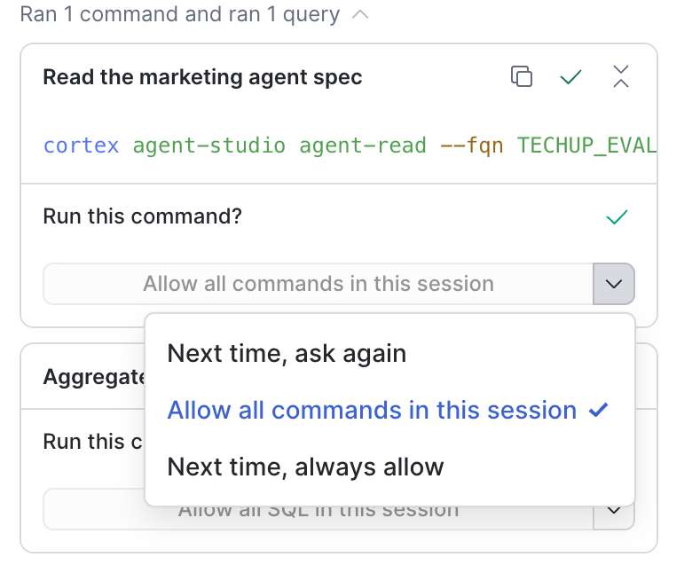

# Option 1: CoCo Snowsight Setup

CoCo is built into Snowsight — no install required. You'll run the lab prompts directly in the browser.

## Step 1: Set your role

Make sure you are using **AGENT_EVAL_ROLE** in Snowsight before proceeding. You can switch
roles from the user menu in the bottom-left corner of Snowsight.

## Step 2: Open CoCo and run the prompts

1. With your workspace open, click the **CoCo** chat icon in Snowsight
2. Confirm the workspace you just set up is the active context
3. Run the prompts from [coco_prompts.txt](./coco_prompts.txt) in order

## Optional: Set `Always allow` for running commands 

When prompt to `Run this command?` by CoCo, select `Always allow`

